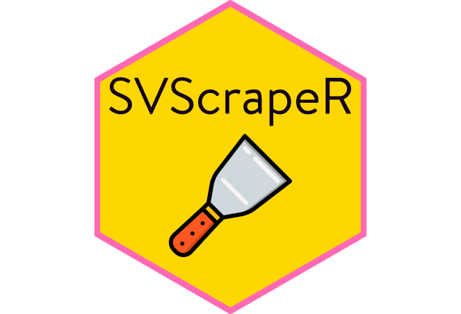

# SVScrapeR </a>

## Beschreibung  
`SVScrapeR` ist ein Funktionspaket, das den Scrapingprozess für HEX standardisieren und dadurch einfacher reproduzierbar und wartbar machen soll. In der aktuellen Version [`1.0.0`](http://srv-data01:30080/hex/hex-hexscrapinghelpers/-/releases/1.0.0) enthält `SVScrapeR` lediglich Rselenium-Wrapper zum Scrapen von HISone-Seiten, die voraussichtlich ab Ende 2025 mehr als 50 % der Vorlesungsverzeichnisse staatlicher deutscher Universitäten bereitstellen werden. Mit `SVScrapeR` sollten diese Universitäten mit nur wenigen Anpassungen von CSS-Selektoren problemlos gescraped werden können.

## Installation

`SVScrapeR 1.0.0` kann folgendermaßen installiert werden:

```r
remotes::install_github("maltehueckstaedt/hex-hexscrapinghelpers")
```

## Vorgehen des Paketes

Das Paket geht folgendermaßen im Rahmen des Scrapings vor:

1. Der Remote-Driver wird gestartet.
2. Die Basiswebsite wird aufgerufen und das zu scrapende Semester wird ausgewählt und aufgerufen.
3. Es werden die Base-Informationen gescrapet, d.h. alle Informationen, die auf den Übersichtsseiten der Semester angezeigt werden. 
4. Insbesondere der Titel wird aufbereitet, um über die Suchmaske von HisOne die entsprechenden Kurse zu suchen und zu finden. 
5. Das Scraping wird vorgenommen. Für jeden Kurs wird die Suchmaske aufgesucht, das Semester ausgewählt, der Kurstitel und die Kursnummer in die Maske eingegeben und der Kurs gesucht. Anschließend werden die relevaten Daten des Kurses erhoben. Die gewonnen Informationen werden Zeilenweise zusammengefügt.
6. Der Chromedriver wird geschlossen und der Java-Prozess gekillt.
7. Die gewonnenen Daten werden (ggf. zusammengeführt und dann) exportiert. 
 


## Nutzung

Siehe für eine beispielhafte Anwendung [diese](http://srv-data01:30080/hex/hex_scraping/-/snippets/9) Vignette.

## Support

Bei Problemen oder Anregungen bitte das Issue-System des Repos nutzen. Bei akuten Problemen gern zusätzlich an Malte Hückstädt oder (Backup) Eike Schröder wenden. 

## Roadmap

`SVScrapeR` soll künftig für das Scraping von HIS-Seiten weiter optimiert werden. Weiterhin sollen weitere Funktion appliziert werden, die das allgemeine Scraping erleichtern und stärker standardisieren. 

## Projektstatus

Das Projekt wird fortlaufend aktualisiert (Stand: März 2025)


